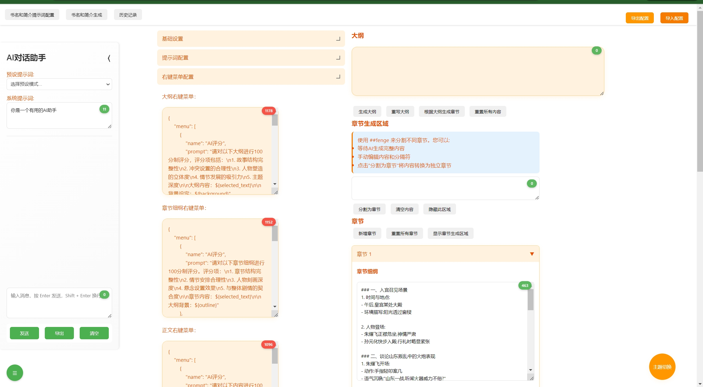

# AI 小说创作助手 (AI Novel Writing Assistant)

一个基于 AI 的智能小说创作辅助工具，通过 AI 技术提升创作效率，效率提升20倍，让写作更轻松、更专业。

## 项目结构

```
├── app.py              # Flask 应用主程序
├── jpg                 # 功能截图文件夹
├── README.md          # 项目说明文档
└── templates          # 前端模板文件夹
    └── index.html     # 主页面模板
```

## 核心功能展示

### 1. 主界面概览



主界面采用双栏布局：
- 左侧：配置面板，包含基础设置和提示词配置
- 右侧：创作区域，包含大纲、章节细纲和正文编辑器

### 2. 智能右键优化

#### 大纲优化


支持的优化选项：
- 增加冲突点
- 扩展情节
- 深化主题

#### 正文润色


自定义润色功能：
- 扩展描写
- 优化对话
- 加强情感

### 3. 智能提示词系统


完整的提示词配置支持：
- 大纲生成提示词
- 章节规划提示词
- 内容创作提示词
- 右键菜单提示词

### 4. 润色确认机制


- 提供润色预览
- 支持确认或取消
- 实时对比修改效果

## 功能优势

### 1. 智能创作
- 一键生成专业大纲
- AI 辅助章节规划
- 智能内容润色
- 上下文感知的优化建议

### 2. 高效管理
- 分层级的内容组织
- 灵活的章节管理
- 智能的内容分割
- 自动保存机制

### 3. 个性化配置
- 自定义提示词模板
- 灵活的右键菜单配置
- 可调整的写作风格
- 多样的优化选项

### 4. 用户友好
- 直观的可视化界面
- 实时预览效果
- 简单的操作流程
- 完善的保存机制

## 快速开始

### 安装
```bash
# 克隆项目
git clone https://github.com/wfcz10086/AI-automatically-generates-novels.git

# 进入项目目录
cd AI-automatically-generates-novels

# 安装依赖
pip install -r requirements.txt
```

### 配置
1. 修改 `app.py` 中的 AI 模型接口地址：
```python
OLLAMA_API_URL = "http://your-api-url"
```

2. 启动应用：
```bash
python app.py
```

默认访问地址：http://localhost:20000

## 使用流程

1. **基础设置**
   - 填写小说背景
   - 设定人物关系
   - 规划核心剧情
   - 选择写作风格

2. **创作流程**
   - 生成初始大纲
   - 规划章节结构
   - 生成章节内容
   - 使用右键菜单优化

3. **内容优化**
   - 选中文本右键优化
   - 预览修改效果
   - 确认或放弃更改
   - 保存最终内容

## 提示词配置说明

### 变量系统
所有提示词模板支持以下变量：
- `${background}` - 背景设定
- `${characters}` - 人物设定
- `${relationships}` - 角色关系
- `${plot}` - 剧情架构
- `${style}` - 写作风格
- `${selected_text}` - 选中文本
- `${outline}` - 当前大纲
- `${chapter_outline}` - 当前章节大纲

### 模板示例
```
基于以下背景：${background}
人物设定：${characters}
角色关系：${relationships}
为选中的内容增加冲突点：${selected_text}
```

# AI 模型接入指南

## 模型配置示例

### 1. Ollama 模型（默认配置）
```python
OLLAMA_API_URL = "http://your-ollama-url:11434/api/generate"

def generate():
    response = requests.post(
        OLLAMA_API_URL,
        json={
            "model": "gemma:7b",  # 可换成其他模型
            "prompt": prompt,
            "stream": True
        },
        stream=True
    )
    # 处理流式响应...
```

### 2. OpenAI API
```python
import openai

def setup_openai():
    openai.api_key = 'your-api-key'
    openai.api_base = 'https://api.openai.com/v1'  # 可替换为其他兼容接口

def generate():
    try:
        response = openai.ChatCompletion.create(
            model="gpt-4",  # 或 gpt-3.5-turbo
            messages=[{
                "role": "user",
                "content": prompt
            }],
            stream=True
        )
        
        for chunk in response:
            if chunk and chunk.choices and chunk.choices[0].delta.content:
                yield chunk.choices[0].delta.content
                
    except Exception as e:
        yield f"Error: {str(e)}"
```

### 3. 文心一言（百度）
```python
from wenxin_api import WenxinAPI
import json

def setup_wenxin():
    return WenxinAPI(
        api_key='your-api-key',
        secret_key='your-secret-key'
    )

def generate():
    api = setup_wenxin()
    try:
        response = api.completion_stream({
            "query": prompt,
            "stream": True,
            "temperature": 0.7,
            "top_p": 0.9
        })
        
        for chunk in response:
            if chunk:
                yield json.loads(chunk)['result']
                
    except Exception as e:
        yield f"Error: {str(e)}"
```

### 4. 讯飞星火
```python
from SparkApi import SparkAPI
import threading

def setup_spark():
    spark = SparkAPI(
        app_id="your-app-id",
        api_key="your-api-key",
        api_secret="your-api-secret"
    )
    return spark

def generate():
    spark = setup_spark()
    try:
        response = spark.chat(
            messages=[{
                "role": "user",
                "content": prompt
            }],
            stream=True
        )
        
        for chunk in response:
            if chunk:
                yield chunk['content']
                
    except Exception as e:
        yield f"Error: {str(e)}"
```

### 5. Claude API（Anthropic）
```python
from anthropic import Anthropic

def setup_claude():
    return Anthropic(api_key="your-api-key")

def generate():
    client = setup_claude()
    try:
        with client.messages.stream(
            model="claude-3-opus-20240229",
            max_tokens=1024,
            messages=[{
                "role": "user",
                "content": prompt
            }]
        ) as stream:
            for text in stream.text_stream:
                yield text
                
    except Exception as e:
        yield f"Error: {str(e)}"
```

### 6. 智谱 ChatGLM
```python
import zhipuai

def setup_chatglm():
    zhipuai.api_key = "your-api-key"

def generate():
    setup_chatglm()
    try:
        response = zhipuai.model_api.sse_invoke(
            model="chatglm_turbo",
            prompt=[{
                "role": "user",
                "content": prompt
            }],
            temperature=0.7,
            top_p=0.9
        )
        
        for event in response.events():
            if event.data:
                yield event.data
                
    except Exception as e:
        yield f"Error: {str(e)}"
```

### 7. 阿里通义千问
```python
from dashscope import Generation

def generate():
    try:
        response = Generation.call(
            model='qwen-plus',
            prompt=prompt,
            api_key='your-api-key',
            stream=True
        )
        
        for chunk in response:
            if chunk.output and chunk.output.text:
                yield chunk.output.text
                
    except Exception as e:
        yield f"Error: {str(e)}"
```

### 8. 360 智脑
```python
import requests

def generate():
    headers = {
        'Authorization': 'Bearer your-api-key',
        'Content-Type': 'application/json'
    }
    
    try:
        response = requests.post(
            'https://api.360.cn/v1/chat/completions',
            headers=headers,
            json={
                'model': '360-GPT',
                'messages': [{
                    'role': 'user',
                    'content': prompt
                }],
                'stream': True
            },
            stream=True
        )
        
        for line in response.iter_lines():
            if line:
                data = json.loads(line.decode('utf-8'))
                if 'choices' in data and len(data['choices']) > 0:
                    yield data['choices'][0]['delta']['content']
                    
    except Exception as e:
        yield f"Error: {str(e)}"
```

## 模型切换配置

要支持多个模型的动态切换，可以在 `app.py` 中添加如下配置：

```python
# 模型配置
AI_MODELS = {
    'ollama': {
        'name': 'Ollama',
        'api_url': 'http://your-ollama-url:11434/api/generate',
        'handler': generate_ollama
    },
    'openai': {
        'name': 'OpenAI',
        'api_key': 'your-openai-key',
        'handler': generate_openai
    },
    'wenxin': {
        'name': '文心一言',
        'api_key': 'your-wenxin-key',
        'secret_key': 'your-wenxin-secret',
        'handler': generate_wenxin
    },
    # ... 其他模型配置
}

# 模型选择路由
@app.route('/set_model', methods=['POST'])
def set_model():
    model_key = request.json.get('model')
    if model_key in AI_MODELS:
        session['current_model'] = model_key
        return {'status': 'success', 'message': f'切换到{AI_MODELS[model_key]["name"]}'}
    return {'status': 'error', 'message': '未知的模型'}, 400

# 统一的生成接口
@app.route('/gen', methods=['POST'])
def generate():
    model_key = session.get('current_model', 'ollama')  # 默认使用 ollama
    model_config = AI_MODELS.get(model_key)
    
    if not model_config:
        return {'status': 'error', 'message': '模型配置错误'}, 500
        
    return Response(
        model_config['handler'](request.json.get('prompt', '')), 
        mimetype='text/plain'
    )
```

## 接入新模型步骤

1. 在 `AI_MODELS` 中添加新模型配置
2. 创建对应的处理函数
3. 确保处理函数支持流式输出
4. 统一错误处理和响应格式

## 错误处理
```python
def handle_api_error(func):
    @wraps(func)
    def wrapper(*args, **kwargs):
        try:
            return func(*args, **kwargs)
        except requests.exceptions.RequestException as e:
            yield f"网络错误: {str(e)}"
        except json.JSONDecodeError as e:
            yield f"响应解析错误: {str(e)}"
        except Exception as e:
            yield f"未知错误: {str(e)}"
    return wrapper
```

## 注意事项

1. API 密钥安全
- 使用环境变量存储密钥
- 不要在代码中硬编码密钥
- 定期轮换密钥

2. 错误处理
- 实现完善的错误处理机制
- 添加日志记录
- 提供用户友好的错误提示

3. 性能优化
- 使用异步处理
- 实现请求重试
- 添加响应缓存

4. 费用控制
- 实现 token 计数
- 设置使用限制
- 添加费用预警

这个指南提供了多个主流 AI 模型的接入示例，可以根据需要选择合适的模型进行.

## 贡献指南

欢迎提交 Pull Request 和 Issue。在提交代码前请确保：
1. 代码风格规范
2. 添加必要注释
3. 更新相关文档
4. 测试功能完整

## 许可证

MIT License

## 问题反馈

如有问题或建议，请通过以下方式反馈：
1. 提交 GitHub Issue
2. 发送邮件到维护者邮箱


